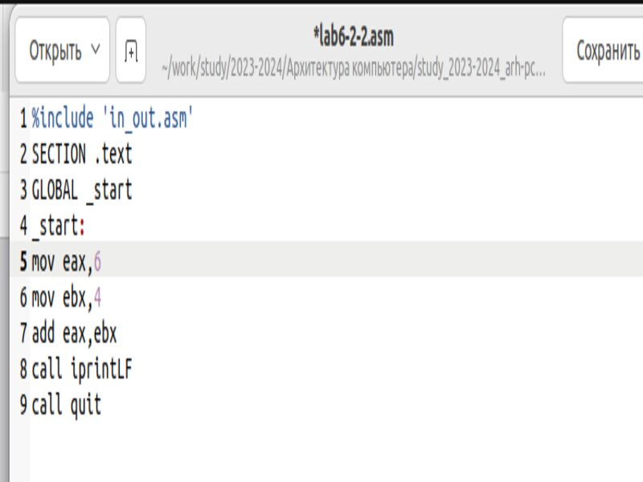
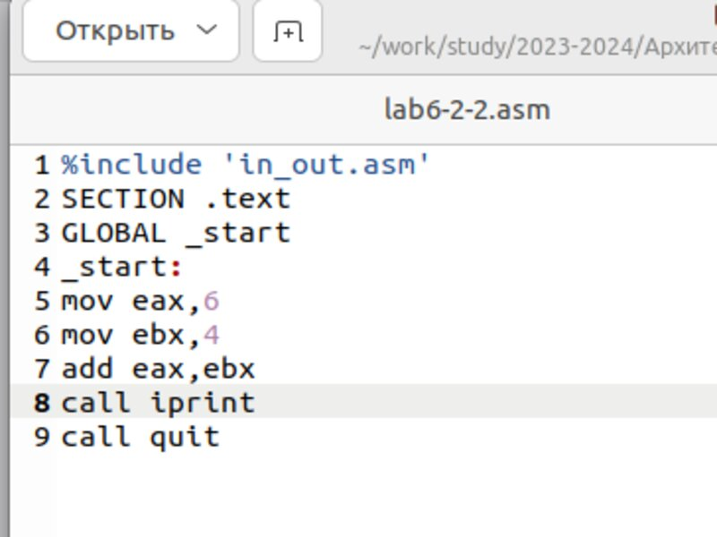

---
## Front matter
title: "Отчёт по лабораторной работе №6"
subtitle: "Дисциплина: архитектура компьютера"
author: "Бизев Никита Владимирович"

## Generic otions
lang: ru-RU
toc-title: "Содержание"

## Bibliography
bibliography: bib/cite.bib
csl: pandoc/csl/gost-r-7-0-5-2008-numeric.csl

## Pdf output format
toc: true # Table of contents
toc-depth: 2
lof: true # List of figures
lot: true # List of tables
fontsize: 12pt
linestretch: 1.5
papersize: a4
documentclass: scrreprt
## I18n polyglossia
polyglossia-lang:
  name: russian
  options:
	- spelling=modern
	- babelshorthands=true
polyglossia-otherlangs:
  name: english
## I18n babel
babel-lang: russian
babel-otherlangs: english
## Fonts
mainfont: PT Serif
romanfont: PT Serif
sansfont: PT Sans
monofont: PT Mono
mainfontoptions: Ligatures=TeX
romanfontoptions: Ligatures=TeX
sansfontoptions: Ligatures=TeX,Scale=MatchLowercase
monofontoptions: Scale=MatchLowercase,Scale=0.9
## Biblatex
biblatex: true
biblio-style: "gost-numeric"
biblatexoptions:
  - parentracker=true
  - backend=biber
  - hyperref=auto
  - language=auto
  - autolang=other*
  - citestyle=gost-numeric
## Pandoc-crossref LaTeX customization
figureTitle: "Рис."
tableTitle: "Таблица"
listingTitle: "Листинг"
lofTitle: "Список иллюстраций"
lotTitle: "Список таблиц"
lolTitle: "Листинги"
## Misc options
indent: true
header-includes:
  - \usepackage{indentfirst}
  - \usepackage{float} # keep figures where there are in the text
  - \floatplacement{figure}{H} # keep figures where there are in the text
---

# Цель работы

Цель данной лабораторной работы - освоение арифметческих инструкций языка ассемблера NASM.

# Задание

1. Символьные и численные данные в NASM
2. Выполнение арифметических операций в NASM
3. Выполнение заданий для самостоятельной работы

# Теоретическое введение

Большинство инструкций на языке ассемблера требуют обработки операндов. Адрес операнда предоставляет место, где хранятся данные, подлежащие обработке. Это могут быть данные хранящиеся в регистре или в ячейке памяти. 
- Регистровая адресация – операнды хранятся в регистрах и в команде используются имена этих регистров, например: mov ax,bx.
- Непосредственная адресация – значение операнда задается непосредственно в команде, Например: mov ax,2.
- Адресация памяти – операнд задает адрес в памяти. В команде указывается символическое обозначение ячейки памяти, над содержимым которой требуется выполнить операцию.

Ввод информации с клавиатуры и вывод её на экран осуществляется в символьном виде. Кодирование этой информации производится согласно кодовой таблице символов ASCII. ASCII – сокращение от American Standard Code for Information Interchange (Американский стандартный код для обмена информацией). Согласно стандарту ASCII каждый символ кодируется одним байтом.
Среди инструкций NASM нет такой, которая выводит числа (не в символьном виде). Поэтому, например, чтобы вывести число, надо предварительно преобразовать его цифры в ASCII-коды этих цифр и выводить на экран эти коды, а не само число. Если же выводить число на экран непосредственно, то экран воспримет его не как число, а как последовательность ASCII-символов – каждый байт числа будет воспринят как один ASCII-символ – и выведет на экран эти символы.
Аналогичная ситуация происходит и при вводе данных с клавиатуры. Введенные данные будут представлять собой символы, что сделает невозможным получение корректного результата при выполнении над ними арифметических операций.
Для решения этой проблемы необходимо проводить преобразование ASCII символов в числа и обратно

# Выполнение лабораторной работы

## Символьные и численные данные в NASM

Создаю файл lab6-1.asm (рис. @fig:001).

{#fig:001 width=70%}

Ввожу в файл lab6-1.asm текст программы из листинга 6.1 (рис. @fig:002).

{#fig:002 width=70%}

Создаю исполняемый файл lab6-1.asm (рис. @fig:003).

{#fig:003 width=70%}

Запускаю файл. (рис. @fig:004).

{#fig:004 width=70%}

Создаю файл lab6-1-1.asm и изменяю в нем символы '6', '4' на числа 6 и 4. (рис. @fig:005).

{#fig:005 width=70%}

Запускаю файл. (рис. @fig:006).

{#fig:006 width=70%}

Теперь вывелся символ с кодом 10, это символ перевода строки, этот символ не отображается при выводе на экран.

Создаю файл lab6-2.asm (рис. @fig:007).

{#fig:007 width=70%}

Ввожу в файл lab6-2.asm текст программы из листинга 6.2.(рис. @fig:008)

{#fig:008 width=70%}

Создаю исполняемый файл и вывожу результат работы программы. (рис. @fig:009).

{#fig:009 width=70%}

Аналагично предыдущему примеру изменяю символы на числа. (рис. @fig:010).

{#fig:010 width=70%}

Вывожу результат с заменой. (рис. @fig:011).

{#fig:011 width=70%}

Результат работы программы - 10.

Создаю файл lab6-2-2 и заменяю функцию inprintLF на iprint. (рис. @fig:012).

{#fig:012 width=70%}

Запускаю программу. (рис. @fig:013).

{#fig:013 width=70%}

При использовании функции iprintLF результат выводится на следующую строку, в то время как при использовании функции iprint результат выводится сразу.

## Выполнение арифметических операций в NASM

Создаю файл lab6-3.asm (рис. @fig:014).

{#fig:014 width=70%}

Открываю файл в текстовом редакторе и ввожу текст программы из листинга 6.3.(рис. @fig:015).

{#fig:015 width=70%}

Создаю исполняемый файл lab6-3 и запускаю его. (рис. @fig:016).

{#fig:016 width=70%}

Результат программы удовлетворяет f(x) = (5 * 2 + 3)/3. Теперь я заменю это выражение на f(x) = (4 * 6 + 2)/5. 

Изменяю файл чтобы он удовлетворял выше указанному выражению. (рис. @fig:017).

{#fig:017 width=70%}

Создаю исполняемый файл lab6-3 и запускаю его. (рис. @fig:018).

{#fig:018 width=70%}

Результат работы - 5, отстаток же - 1.

Рассмотрим другой пример. 

Создаю файл variant.asm (рис. @fig:019).

{#fig:019 width=70%}

Ввожу текст программы из листинга 6.4 в файл. (рис. @fig:020).

{#fig:020 width=70%}

Программа запрашивает № студенческого билета и основываясь на нем выводит мой вариант. 
Номер моего студенческого билет - 1132230806.

Создаю исполняемый файл variant и запускаю его. (рис. @fig:021).

{#fig:021 width=70%}

### Ответы на вопросы по программе

1. За вывод сообщения "Ваш вариант" отвечают строки кода:

```NASM
mov eax,rem
call sprint
```
2. Инструкция mov ecx, x используется, чтобы положить адрес вводимой строки x в регистр ecx
mov edx, 80 - запись в регистр edx длины вводимой строки 
call sread - вызов подпрограммы из внешнего файла, обеспечивающей ввод сообщения с клавиатуры  

3. call atoi используется для вызова подпрограммы из внешнего файла, которая преобразует ascii-код символа в целое число и записывает результат в регистр eax

4. За вычисления варианта отвечают строки:

```NASM
xor edx,edx ; обнуление edx для корректной работы div
mov ebx,20 ; ebx = 20
div ebx ; eax = eax/20, edx - остаток от деления
inc edx ; edx = edx + 1
```

5. При выполнении инструкции div ebx остаток от деления записывается в регистр edx

6. Инструкция inc edx увеличивает значение регистра edx на 1

7. За вывод на экран результатов вычислений отвечают строки:

```NASM
mov eax,edx
call iprintLF
```

## **Задание для самостоятельной работы**

Вывод программы variant.asm показал, что мой номер варианта - 10, поэтому мне нужно написать программу (rabota.asm) для вычисления выражения 5(x + 18) − 28 и проверить ее работу для значений х1 = 2 и х2 = 3. (рис. @fig:022).

{#fig:022 width=70%}

Создаю исполняемый файл. (рис. @fig:023) (рис. @fig:024).

{#fig:023 width=70%

Проверяю его работоспособность. 

{#fig:023 width=70%

Ответ 72 и 73
# Выводы

При выполнении данной лабораторной работы я освоила арифметические инструкции языка ассемблера NASM.

# Список литературы{.unnumbered}

1. https://esystem.rudn.ru/pluginfile.php/2089086/mod_resource/content/0/%D0%9B%D0%B0%D0%B1%D0%BE%D1%80%D0%B0%D1%82%D0%BE%D1%80%D0%BD%D0%B0%D1%8F%20%D1%80%D0%B0%D0%B1%D0%BE%D1%82%D0%B0%20%E2%84%966.%20%D0%90%D1%80%D0%B8%D1%84%D0%BC%D0%B5%D1%82%D0%B8%D1%87%D0%B5%D1%81%D0%BA%D0%B8%D0%B5%20%D0%BE%D0%BF%D0%B5%D1%80%D0%B0%D1%86%D0%B8%D0%B8%20%D0%B2%20NASM..pdf
