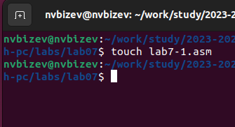
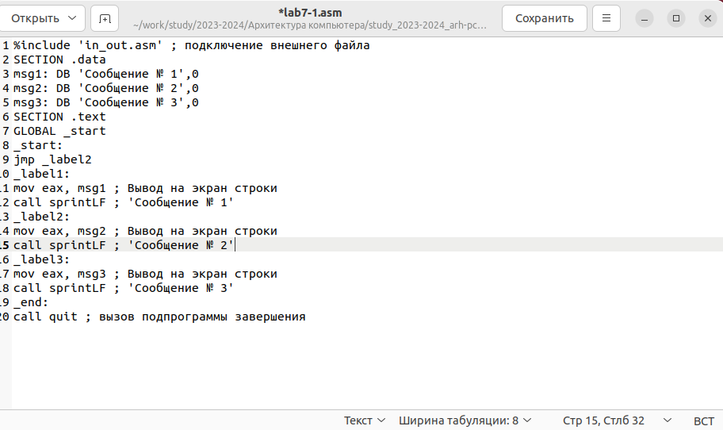
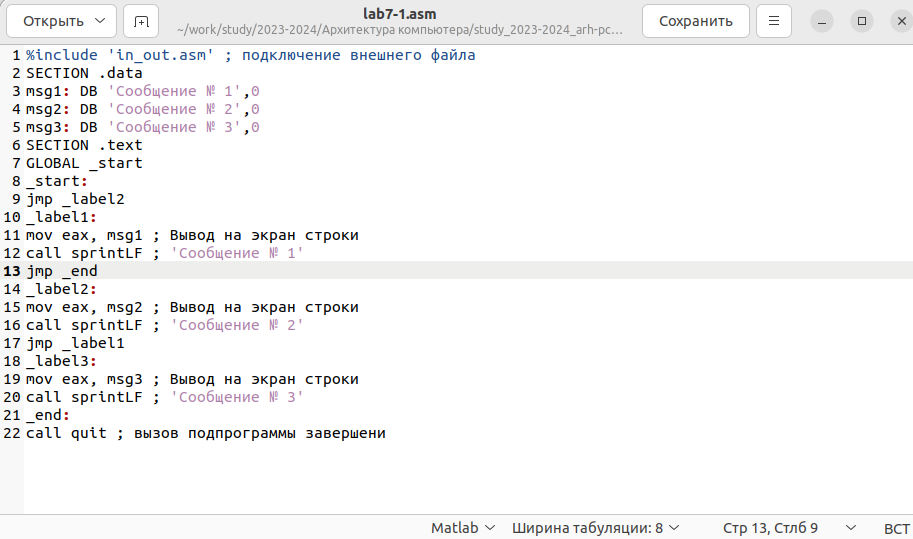
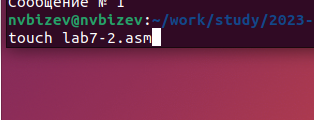
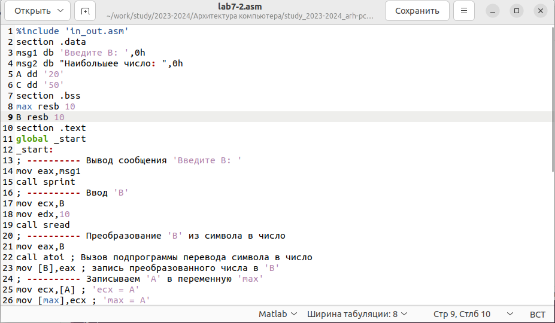
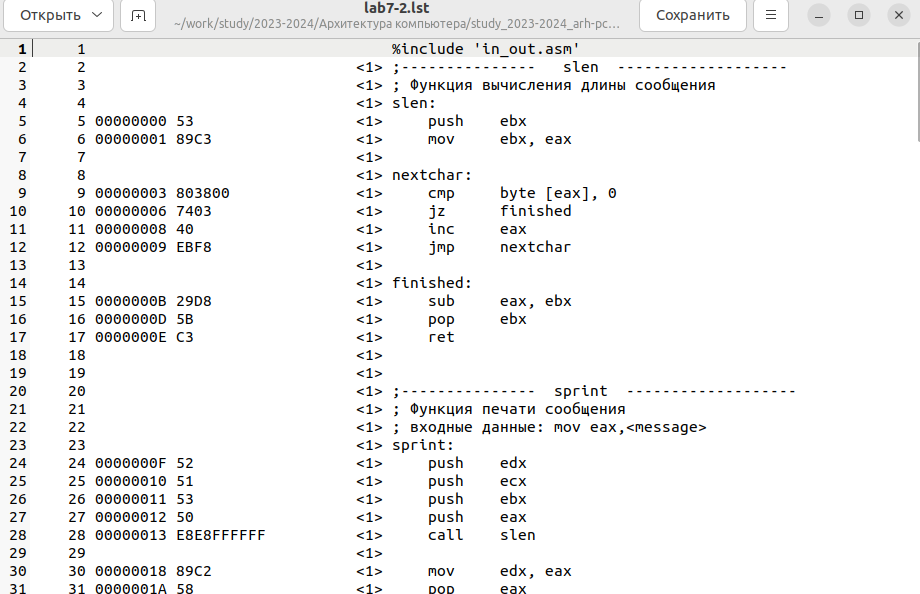

---
## Front matter
title: "Отчёт по лабораторной работе №7"
subtitle: "Дисциплина: архитектура компьютеров и операционные системы"
author: "Бизев Никита Владимирович"

## Generic otions
lang: ru-RU
toc-title: "Содержание"

## Bibliography
bibliography: bib/cite.bib
csl: pandoc/csl/gost-r-7-0-5-2008-numeric.csl

## Pdf output format
toc: true # Table of contents
toc-depth: 2
lof: true # List of figures
lot: true # List of tables
fontsize: 12pt
linestretch: 1.5
papersize: a4
documentclass: scrreprt
## I18n polyglossia
polyglossia-lang:
  name: russian
  options:
	- spelling=modern
	- babelshorthands=true
polyglossia-otherlangs:
  name: english
## I18n babel
babel-lang: russian
babel-otherlangs: english
## Fonts
mainfont: PT Serif
romanfont: PT Serif
sansfont: PT Sans
monofont: PT Mono
mainfontoptions: Ligatures=TeX
romanfontoptions: Ligatures=TeX
sansfontoptions: Ligatures=TeX,Scale=MatchLowercase
monofontoptions: Scale=MatchLowercase,Scale=0.9
## Biblatex
biblatex: true
biblio-style: "gost-numeric"
biblatexoptions:
  - parentracker=true
  - backend=biber
  - hyperref=auto
  - language=auto
  - autolang=other*
  - citestyle=gost-numeric
## Pandoc-crossref LaTeX customization
figureTitle: "Рис."
tableTitle: "Таблица"
listingTitle: "Листинг"
lofTitle: "Список иллюстраций"
lotTitle: "Список таблиц"
lolTitle: "Листинги"
## Misc options
indent: true
header-includes:
  - \usepackage{indentfirst}
  - \usepackage{float} # keep figures where there are in the text
  - \floatplacement{figure}{H} # keep figures where there are in the text
---

# Цель работы

Изучение команд условного и безусловного переходов. Приобретение навыков написания
программ с использованием переходов. Знакомство с назначением и структурой файла
листинга.

# Задание

1. Реализация переходов в NASM.
2. Изучение структуры файлы листинга.
3. Задания для самостоятельной работы.

# Теоретическое введение

Для реализации ветвлений в ассемблере используются так называемые команды передачи
управления или команды перехода. Можно выделить 2 типа переходов:

• условный переход – выполнение или не выполнение перехода в определенную точку
программы в зависимости от проверки условия.

• безусловный переход – выполнение передачи управления в определенную точку программы без каких-либо условий.

Безусловный переход выполняется инструкцией jmp. Инструкция cmp является одной из инструкций, которая позволяет сравнить операнды и
выставляет флаги в зависимости от результата сравнения.
Инструкция cmp является командой сравнения двух операндов и имеет такой же формат,
как и команда вычитания.

Листинг (в рамках понятийного аппарата NASM) — это один из выходных файлов, создаваемых транслятором. Он имеет текстовый вид и нужен при отладке программы, так как
кроме строк самой программы он содержит дополнительную информацию.

# Выполнение лабораторной работы

## **Реализация переходов в NASM**

Создаю каталог для программ лабораторной работы № 7, перехожу в него и создаю файл lab7-1.asm. (рис. @fig:001).

{#fig:001 width=70%}

Ввожу в файл lab7-1.asm текст программы из листинга 7.1. (рис. @fig:002).

{#fig:002 width=70%}

Создаю исполняемый файл и запускаю его. (рис. @fig:003).

{#fig:003 width=70%}

Таким образом, использование инструкции jmp _label2 меняет порядок исполнения
инструкций и позволяет выполнить инструкции начиная с метки _label2, пропустив вывод
первого сообщения.

Изменю программу таким образом, чтобы она выводила сначала ‘Сообщение № 2’, потом ‘Сообщение № 1’ и завершала работу. Для этого изменяю текст программы в соответствии с листингом 7.2. (рис. @fig:004).

{#fig:004 width=70%}

Создаю исполняемый файл и проверяю его работу. (рис. @fig:005).

{#fig:005 width=70%}

Затем изменяю текст программы, добавив в начале программы jmp _label3, jmp _label2 в конце метки jmp _label3, jmp _label1 добавляю в конце метки jmp _label2, и добавляю jmp _end в конце метки jmp _label1, (рис. @fig:006).

{#fig:006 width=70%}

чтобы вывод программы был следующим: (рис. @fig:007).

{#fig:007 width=70%}

Рассмотрим программу, которая определяет и выводит на экран наибольшую из 3 целочисленных переменных: A,B и C. Значения для A и C задаются в программе, значение B вводиться с клавиатуры.

Создаю файл lab7-2.asm в каталоге ~/work/arch-pc/lab07. (рис. @fig:008).

{#fig:008 width=70%}

Текст программы из листинга 7.3 ввожу в lab7-2.asm. (рис. @fig:009).

{#fig:009 width=70%}

Создаю исполняемый файл и проверьте его работу. (рис. @fig:010).

{#fig:010 width=70%}

Файл работает корректно.

## **Изучение структуры файлы листинга**

Создаю файл листинга для программы из файла lab7-2.asm. (рис. @fig:011).

{#fig:011 width=70%}

Открываю файл листинга lab7-2.lst с помощью текстового редактора и внимательно изучаю его формат и содержимое. (рис. @fig:012).

{#fig:012 width=70%}

В представленных трех строчках содержаться следующие данные: (рис. @fig:013).

{#fig:013 width=70%}

"3" - номер строки кода, "; Функция вычисления длинны сообщения" - комментарий к коду, не имеет адреса и машинного кода.

"4" - номер строки кода, "slen" - название функции, не имеет адреса и машинного кода.

"5" - номер строки кода, "00000000" - адрес строки, "53" - машинный код, "push ebx" - исходный текст программы, инструкция "push" помещает операнд "ebx" в стек.

Открываю файл с программой lab7-2.asm и в выбранной мной инструкции с двумя операндами удаляю выделенный операнд. (рис. @fig:014).

{#fig:014 width=70%}

Выполняю трансляцию с получением файла листинга. (рис. @fig:015).

{#fig:015 width=70%}

На выходе я не получаю ни одного файла из-за ошибки:инструкция mov 
(единственная в коде содержит два операнда) не может работать, имея только один операнд, из-за чего нарушается работа кода.

# Выводы

По итогам данной лабораторной работы я изучил команды условного и безусловного переходов, приобрел навыки написания программ с использованием переходов и  ознакомился с назначением и структурой файла листинга, что поможет мне при выполнении последующих лабораторных работ.

# Список литературы

https://esystem.rudn.ru/pluginfile.php/2089087/mod_resource/content/0/%D0%9B%D0%B0%D0%B1%D0%BE%D1%80%D0%B0%D1%82%D0%BE%D1%80%D0%BD%D0%B0%D1%8F%20%D1%80%D0%B0%D0%B1%D0%BE%D1%82%D0%B0%20%E2%84%967.%20%D0%9A%D0%BE%D0%BC%D0%B0%D0%BD%D0%B4%D1%8B%20%D0%B1%D0%B5%D0%B7%D1%83%D1%81%D0%BB%D0%BE%D0%B2%D0%BD%D0%BE%D0%B3%D0%BE%20%D0%B8%20%D1%83%D1%81%D0%BB%D0%BE%D0%B2%D0%BD%D0%BE%D0%B3%D0%BE%20%D0%BF%D0%B5%D1%80%D0%B5%D1%85%D0%BE%D0%B4%D0%BE%D0%B2%20%D0%B2%20Nasm.%20%D0%9F%D1%80%D0%BE%D0%B3%D1%80%D0%B0%D0%BC%D0%BC%D0%B8%D1%80%D0%BE%D0%B2%D0%B0%D0%BD%D0%B8%D0%B5%20%D0%B2%D0%B5%D1%82%D0%B2%D0%BB%D0%B5%D0%BD%D0%B8%D0%B9..pdf

